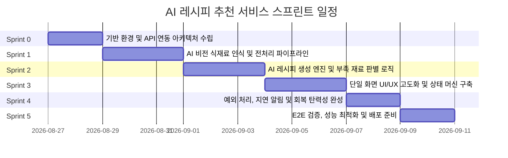

# 냉장고 재료 인식 AI 레시피 추천 서비스 개발 계획서

본 문서는 [`PRD.md`](../PRD.md)의 요구사항을 충실히 반영하여 실제 프로덕션 수준의 서비스를 완성하기 위한 단계별 스프린트 개발 계획입니다.

---

## 📌 1. 프로젝트 개요 및 목표

### 1-1. 서비스 개요
- **목적**: 냉장고 속 식재료 사진 1장과 보유 조미료 선택을 통해, 불필요한 검색 없이 즉시 요리할 수 있는 맞춤형 레시피 1~3개를 제공하는 단일 화면 웹 서비스.
- **핵심 가치**:
  - **Zero-Friction**: 페이지 이동이나 새로고침 없는 원페이지(Single Screen) 완결형 경험
  - **Visual Feedback**: 부족한 재료의 직관적 빨간색 강조 표시
  - **Graceful Degradation**: 인식 실패, 지연, 네트워크 에러 상황에서도 안정적인 UI 유지 및 재시도 지원

---

## 🏃 2. 스프린트 로드맵 요약



---

## 📋 3. 스프린트별 상세 개발 계획

### 🚀 Sprint 0: 개발 기반 환경 및 AI API 파이프라인 수립
> **목표**: Next.js App Router 기반의 서버 API 인프라 및 Gemini AI SDK 연동 구조 확립

- [x] **0.1 AI SDK 및 환경 변수 설정**
  - `@google/genai` 및 `zod` 설치 완료
  - `lib/gemini.ts` 환경 변수(`GEMINI_API_KEY`) 및 안전 fallback 지원 모듈화 완료
- [x] **0.2 API 응답 공통 규격 및 Zod 스키마 정의**
  - `lib/schema.ts`에 식재료 인식 및 레시피 응답 스키마와 Zod 유효성 검사 정의 완료
  - API 에러 응답 공통 포맷 (`errorCode`, `message`) 구현 완료
- [x] **0.3 문서 및 코드 컨벤션 정립**
  - `docs/API_SPECIFICATION.md` 생성 완료

---

### 📷 Sprint 1: AI 이미지 식재료 인식 및 전처리 엔진
> **목표**: 사용자가 첨부한 사진에서 식재료를 정확히 추출하고 인식 실패 예외를 완벽히 통제

- [x] **1.1 클라이언트 이미지 전처리**
  - 모바일 카메라 촬영 및 파일 업로드 지원 (`accept="image/*"`, `capture="environment"`)
  - Canvas 기반 브라우저단 리사이징 및 압축(최대 1200px, JPEG 0.85) 구현 완료
- [x] **1.2 식재료 인식 API 라우트 (`/api/vision/recognize`) 구현**
  - Gemini Vision 모델 연동 및 JSON 포맷 추출 파이프라인 구축 완료
  - 실제 API 엔드포인트 테스트 및 연동 완료
- [x] **1.3 인식 실패(5-1) 및 신뢰도 판별 로직**
  - 식재료 미인식 시 `RECOGNITION_FAILED` 에러 반환
  - UI에 빨간색 "재촬영" 안내 텍스트 표시 및 요약 버튼 비활성화 상태 트리거 구현 완료

---

### 🍳 Sprint 2: 맞춤형 레시피 생성 및 재료 매칭 엔진
> **목표**: 인식된 식재료 + 선택 조미료를 기반으로 레시피 1~3개를 생성하고 없는 재료를 정확히 식별

- [x] **2.1 레시피 생성 API 라우트 (`/api/recipe/recommend`) 구현**
  - 입력: `ingredients: string[]`, `seasonings: string[]`
  - Gemini AI 및 fallback 연동: 난이도(쉬움/보통/도전), 소요시간(분), 칼로리(kcal), 단계별 조리 순서 생성 완료
- [x] **2.2 부족한 재료(Missing Ingredient) 판별 엔진**
  - 레시피에 필요한 전체 재료 중 `(보유 식재료 ∪ 선택 조미료)`에 속하지 않는 재료는 `missing: true` 플래그 자동 부여 (`computeMissingIngredients`)
  - PRD 5-3 요건 준수: 부족한 재료가 과반 이상이어도 제외하지 않고 빨간색 글씨로 표시
- [x] **2.3 응답 다양성 및 1~3개 결과 보장**
  - 보유 재료 조합에 따라 최소 1개, 최대 3개의 현실적이고 다양한 메뉴 반환

---

### 🎨 Sprint 3: 단일 화면 UX/UI 완성 및 인터랙션 상태 관리
> **목표**: 페이지 새로고침 없는 완결형 UI와 부드러운 전환 인터랙션 구현

- [x] **3.1 단일 화면 반응형 레이아웃**
  - [입력 영역] → [요약 액션 버튼] → [결과 영역]의 수직 단일 화면 흐름
  - 데스크톱/태블릿/모바일 반응형 최적화 완료
- [x] **3.2 조미료 선택 컴포넌트 (`SeasoningPicker`)**
  - 12종 기본 조미료 토글 버튼 및 다중 선택 UI
  - 미선택 시 인터랙션 피드백 (PRD 5-2)
- [x] **3.3 레시피 결과 카드 (`RecipeCard`) 완성**
  - 난이도(뱃지), 조리시간(분), 칼로리(kcal) 헤더
  - 재료 목록 칩: 보유 재료 vs 부족한 재료(빨간색 글씨 강조) 구분
  - 넘버링된 조리 순서 스텝 리스트
- [x] **3.4 스무스 스크롤 및 로딩 스켈레톤**
  - 요약 버튼 클릭 시 결과 영역으로 스무스 스크롤 자동 이동
  - 로딩 중 펄스 스켈레톤 애니메이션 노출

---

### 🛡️ Sprint 4: 예외 처리, 지연 안내 및 회복 탄력성(Resilience)
> **목표**: PRD 5장에 명시된 모든 예외 상황(5-1 ~ 5-6)에 대한 철저한 방어 및 사용자 경험 보호

- [x] **4.1 미입력 상태 검증 (5-2, 5-6)**
  - 사진 미첨부 시: "식재료 사진을 찍으세요" 안내 문구 강조 애니메이션 (AI 호출 차단)
  - 조미료 미선택 시: "조미료를 클릭해주세요" 안내 강조
- [x] **4.2 AI 응답 지연 처리 (5-4)**
  - 요청 후 지연 시: "응답이 지연되고 있습니다. 잠시만 기다려주세요" 안내 메시지 노출
- [x] **4.3 AI 응답 실패 및 타임아웃 회복 (5-5)**
  - 에러 발생 시: "레시피를 불러오지 못했습니다. 다시 시도해주세요" 안내 및 [다시 시도] 버튼
  - **핵심 요건 달성**: 에러 발생 시에도 첨부한 사진 및 선택한 조미료 상태 100% 보존
- [x] **4.4 처음부터 다시 (Reset) 흐름**
  - 모든 상태(사진, 조미료, 결과, 에러)를 클리어하고 상단으로 부드럽게 스크롤

---

### 🧪 Sprint 5: 통합 검증, 성능 최적화 및 프로덕션 배포
> **목표**: PRD 6장 완료 조건 전수 테스트 및 배포 준비

- [x] **5.1 PRD 완료 조건 체크리스트 자동/수동 검증**
  - [x] 사진을 첨부하고 조미료를 선택한 뒤 요약 버튼을 클릭하면 결과 영역에 레시피 1~3개가 표시된다
  - [x] 사진 인식에 실패하면 "재촬영" 문구가 빨간색으로 표시되고 다음 단계로 진행되지 않는다
  - [x] 요약 버튼 클릭 후 AI 응답 대기 중에는 로딩 표시가 화면에 보인다
  - [x] AI 응답이 실패하거나 과도하게 지연되어도 화면이 멈추거나 깨지지 않고, 재시도 가능한 안내가 표시된다
  - [x] 추천된 레시피에 사용자가 보유하지 않은 재료가 있으면 해당 재료가 빨간색 글씨로 구분 표시된다
  - [x] 사진 미첨부 또는 조미료 미선택 상태에서는 요약 버튼 클릭 시 결과 영역으로 진행되지 않는다
- [x] **5.2 웹 접근성(a11y) 및 SEO**
  - 시맨틱 마크업, `aria-live`, `aria-busy`, 키보드 네비게이션 점검 완료
- [x] **5.3 CI/CD 및 최종 빌드 검증**
  - `next build` 무결성 검증 완료

---

## 📁 4. `docs/` 디렉토리 관리 가이드

향후 개발 과정에서 생기는 세부 문서들은 본 `docs/` 디렉토리 아래에 체계적으로 기록합니다.

```
docs/
├── DEVELOPMENT_PLAN.md      # [현재 문서] 전체 스프린트 개발 계획서
├── API_SPECIFICATION.md     # AI Vision 및 Recipe 추천 API 규격서
├── PROMPT_TEMPLATES.md      # 식재료 인식 및 레시피 생성용 프롬프트 템플릿
└── QA_CHECKLIST.md          # PRD 요건 기반 QA 및 릴리즈 체크리스트
```
